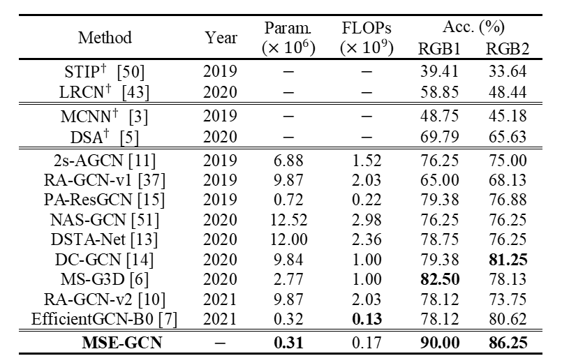
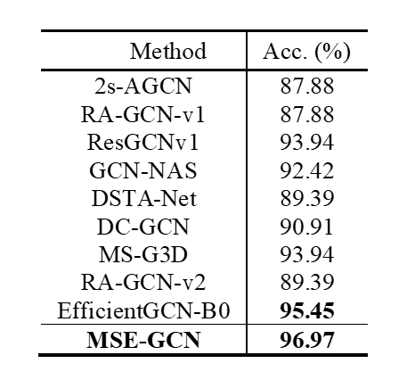

# Multi-Scale Excitation Graph Convolution Network（MSE-GCN）

##  1 Paper Details

We propose the MSE-GCN and aims to mitigate the negative effect of incomplete skeletons for improving the performance of Driver Behavior Recognition (DBR) task. Our proposed method consists of three important components: an effective padding strategy and a novel graph convolution layer and an efficient temporal convolution layer.

The datasets for model evaluation are Drive&Act, 3MDAD and EBDD. 

Notably, Drive&Act is **a large-scale, fine-grained, multi-modal and cross-view benchmark** is collected from the static driving simulator for video- and body pose-based driver behavior recognition. And the above table reports the results of our proposed MSE-GCN and other state-of-the-art methods for recognizing **12 coarse tasks, 34 fine-grained activities, 6 actions, 17 object categories, 14 locations, and 372 all possible combinations**. Overall, our approach **outperforms the previous body pose-based approaches** for recognizing the fine-grained activities, action, and all possible combinations, while achieves a comparable performance for the coarse tasks, *object*, and *location* classifications.  Details are seen in Section 3.3.

The following picture is the pipeline of MSE-GCN. (some details are mosaicked until this work was publish)

### 

##  2 Visualization On 3MDAD

By class activation map, we can find that the MSE-GCN model successfully concentrates on the most informative joints, e.g., right wrist and head for *Talking phone using right hand*, *Having picture* and *Fatigue and somnolence*, left arm for *Drinking using left hand*, and *upper body for Reaching behind*. This implies that the proposed works well.

##  3 Results

### 3.1 3MDAD Dataset

### 3.2 EBDD Dataset

### 3.3 Drive&Act Dataset

